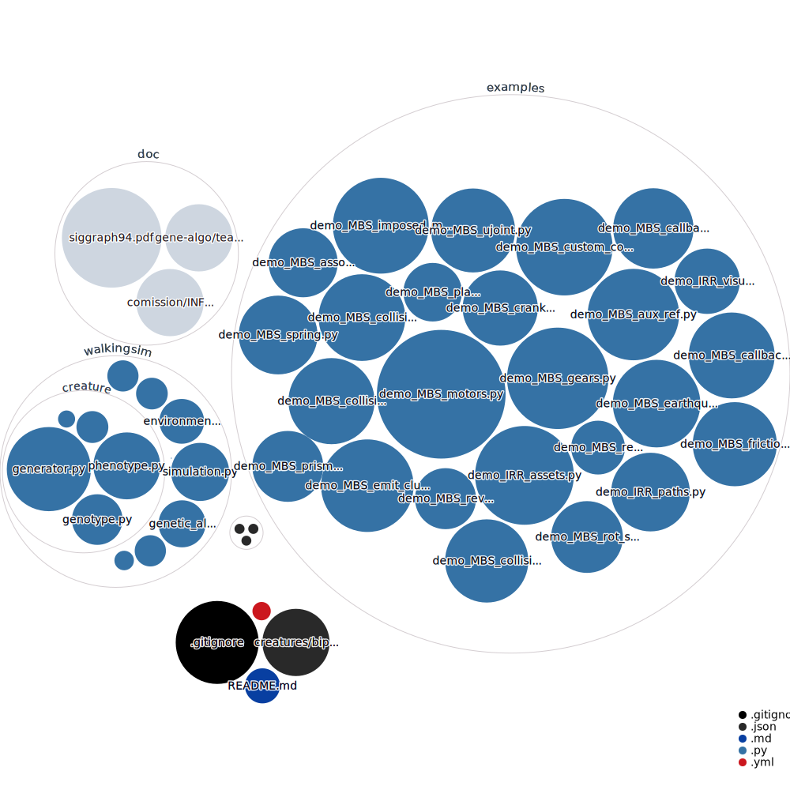

# project-default-template

GitHub uses its own Markup library to render files like READMEs. It supports:
  langages:
```
    Markdown
    Textile
    RDoc
    Org
    Creole
    MediaWiki
    Restructured Text
    AsciiDoc
    Perl Pod
 ```
  image format:
  ```
    PNG, 
    JPG, 
    GIF, 
    PSD,  
    SVG
```


### table
```
title1           |  title2
:-------------------------:|:-------------------------:
cell1| cell2
  ```

title1           |  title2
:-------------------------:|:-------------------------:
cell1| cell2
  
  
## github actions: 

### Create repository visualizer diagram
```
name: Create repository visualizer diagram
on:
  push
jobs:
  get_data:
    runs-on: ubuntu-latest
    steps:
      - name: Checkout code
        uses: actions/checkout@master
      - name: Update diagram
        uses: githubocto/repo-visualizer@0.7.1
        with:
          excluded_paths: "ignore,.github"
```
          
```

```


### latex-pandoc-docx

```
name: latex-pandoc-docx
on: [push]
jobs:
  build_latex:
    runs-on: ubuntu-latest
    steps:
      - name: Set up Git repository
        uses: actions/checkout@v1
      - name: Compile LaTeX document
        uses: xu-cheng/latex-action@master
        with:
          root_file: hello.tex
  convert_via_pandoc:
    runs-on: ubuntu-latest
    steps:
      - uses: actions/checkout@v2
      - uses: docker://pandoc/core:2.9
        with:
          args: >-
            -s hello.tex
            -f latex
            -t docx
            -o hello.docx
      - uses: actions/upload-artifact@master
        with:
          name: hello
          path: hello.docx
```


### zip repository
```

```

### commit artifact to repository
https://gitlab.com/jasonrwang/dissertation-tudelft-latex/

```

build:
  image: ctornau/latex
  stage: build
  script:
    - latexmk -pdf -pdflatex="xelatex -interaction=nonstopmode" -use-make *.tex
  artifacts:
    when: on_success
    paths:
      - ./*.pdf
    expire_in: 5 min # might not need this if deploy works


deploy:
  stage: deploy
  before_script:
    - 'which ssh-agent || ( apt-get update -qy && apt-get install openssh-client -qqy )'
    - eval `ssh-agent -s`
    - echo "${SSH_PRIVATE_KEY}" | tr -d '\r' | ssh-add - > /dev/null # add ssh key
    - mkdir -p ~/.ssh
    - chmod 700 ~/.ssh
    - echo "$SSH_PUBLIC_KEY" >> ~/.ssh/id_rsa.pub
    - '[[ -f /.dockerenv ]] && echo -e "Host *\n\tStrictHostKeyChecking no\n\n" > ~/.ssh/config'
  script:
    - git config --global user.email "${CI_EMAIL}"
    - git config --global user.name "${CI_USERNAME}"
    - git add -f *.pdf # Force add PDF since we .gitignored it
    - git commit -m "Compiled PDF from $CI_COMMIT_SHORT_SHA [skip ci]" || echo "No changes, nothing to commit!"
    - git remote rm origin && git remote add origin git@gitlab.com:$CI_PROJECT_PATH.git
    - git push origin HEAD:$CI_COMMIT_REF_NAME # Pushes to the same branch as the trigger
    ```
    
